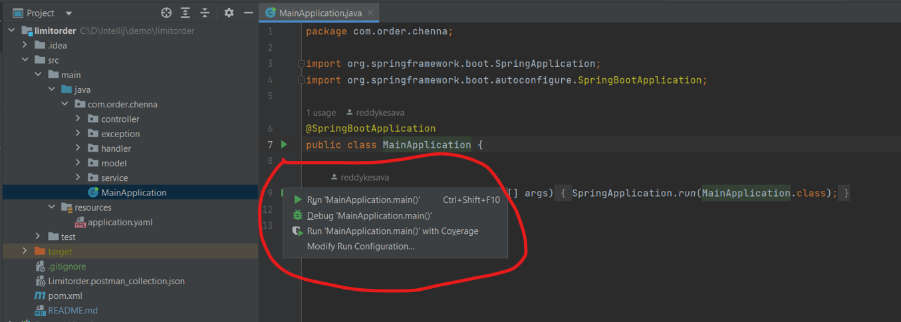

# Getting Started

## Softwares used.
1. Intellij,
2. Java 11
3. Postman
4. Spring boot
5. Maven
6. Git, Github

## How to run the application

As shown in the above image open the MainApplication click on the green colour run symbol and click on run option.

### Reference Documentation
There are 8 apis
1. Create Order
2. Update Order
3. Delete Order
4. Display Order book
5. Display order by id

### Sample Postman collection is attached in the repo root location

### 

For successful cases please follow the same order in which the collection requests are there.
